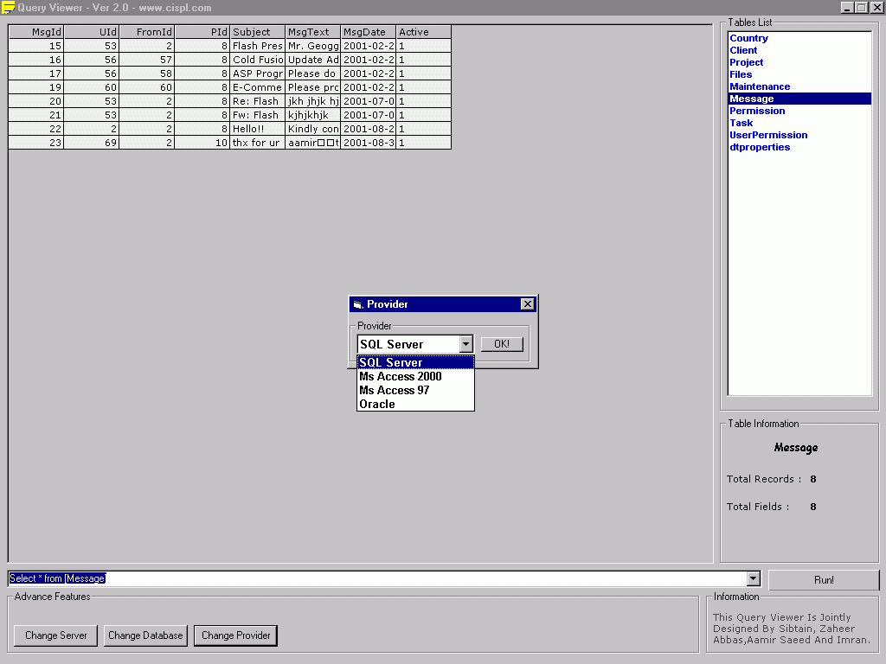



## Query Viewer ver \- 2\.0

### Description

This is a Multi Database Query Viewer which supports SQL Server 7.0 , Ms Access 2000 , Ms Access 97 and Oracle(which will be available in next ver) Databases . You can write the query and view the results on the grid. It also gives you some information of tables. You can change provider any time. Plz Vote!!!!!!!
 
### More Info
 

             |
---                |---
**Submitted On**   |2001-08-30 11:49:22
**By**             |[Sibtain Raza](https://github.com/Planet-Source-Code/PSCIndex/blob/master/ByAuthor/sibtain-raza.md)
**Level**          |Advanced
**User Rating**    |4.8 (24 globes from 5 users)
**Compatibility**  |VB 6\.0
**Category**       |[Complete Applications](https://github.com/Planet-Source-Code/PSCIndex/blob/master/ByCategory/complete-applications__1-27.md)
**World**          |[Visual Basic](https://github.com/Planet-Source-Code/PSCIndex/blob/master/ByWorld/visual-basic.md)
**Archive File**   |[Query View255818302001\.zip](https://github.com/Planet-Source-Code/sibtain-raza-query-viewer-ver-2-0__1-26795/archive/master.zip)

